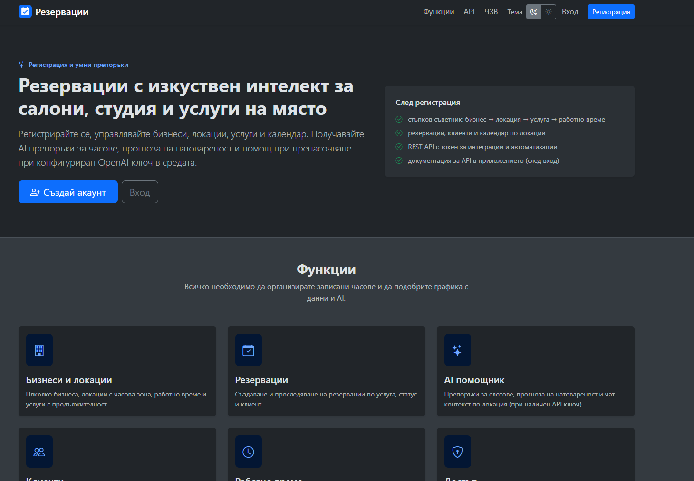
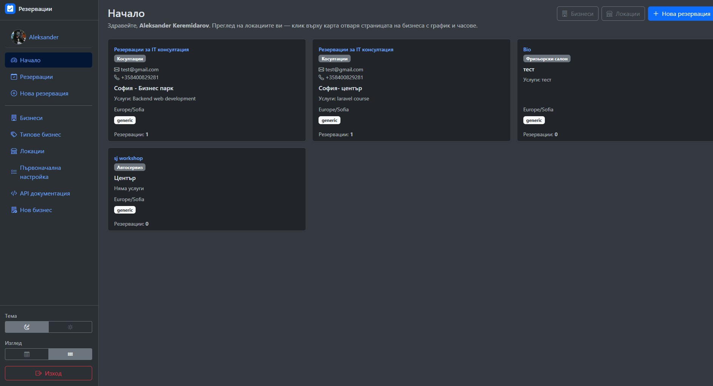
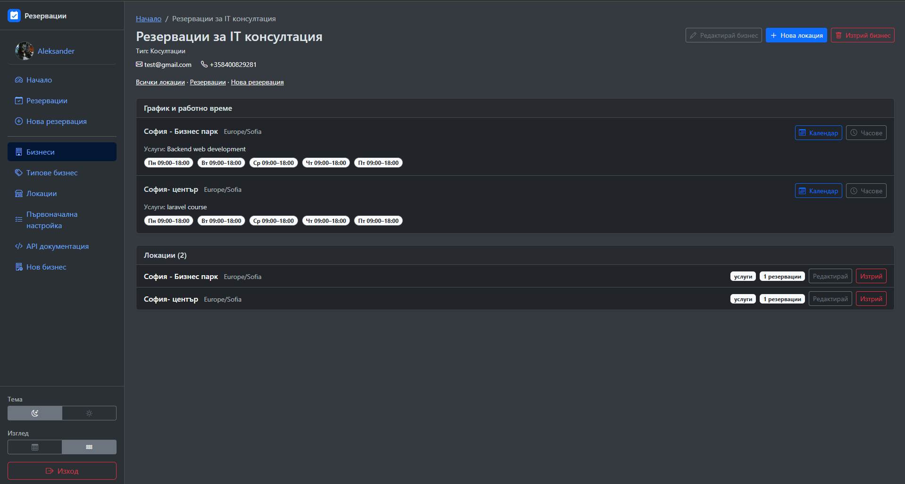
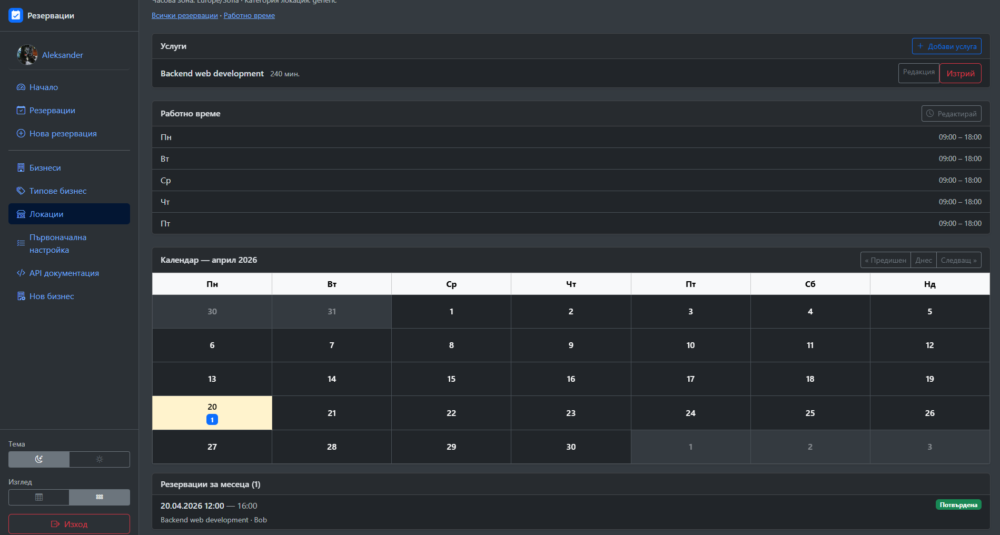
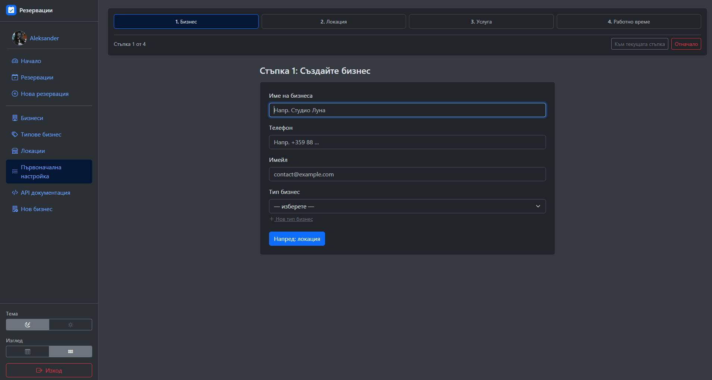
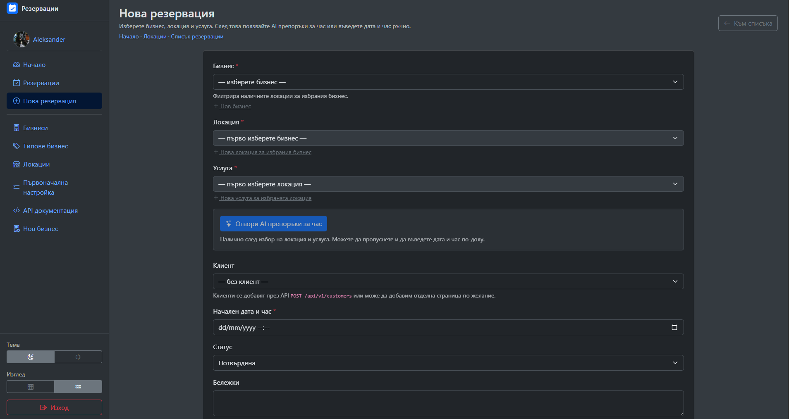
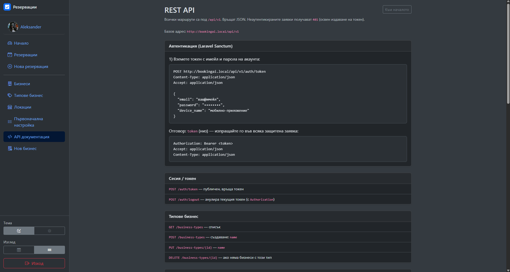

# BookingAI / Резервации

Уеб приложение на **Laravel 13** и **PHP 8.3+** за управление на **бизнеси**, **локации (venues)**, **услуги**, **клиенти** и **резервации**, с опционални **AI** възможности (препоръки за слотове, натовареност, чат и др.) чрез **OpenAI API**. Включва **REST API** с **Laravel Sanctum** (Bearer токен) и първоначален **съветник** за настройка.

Интерфейсът е на **български**; навигация, тъмна/светла тема, публична начална страница, политика за поверителност, условия, ЧЗВ и банер за бисквитки.

---

## Съдържание

- [Общо представяне](#общо-представяне)
- [Скрийншоти](#скрийншоти)
- [Технологии](#технологии)
- [Клониране](#клониране)
- [Инсталиране](#инсталиране)
- [Конфигурация (.env)](#конфигурация-env)
- [Функционалности](#функционалности)
- [REST API](#rest-api)
- [Тестове и качество на кода](#тестове-и-качество-на-кода)
- [Полезни команди](#полезни-команди)
- [Лиценз](#лиценз)

---

## Общо представяне

Проектът е ориентиран към услуги със записани часове: фризьорски салони, студия, консултации и др. Потребителите си създават акаунт, дефинират бизнес и локации, услуги с продължителност, работно време, и водят резервации. Опционално се използва **OpenAI** за интелигентни подсказки, когато в `.env` е зададен `OPENAI_API_KEY`.

---

## Скрийншоти

Изображенията са в [`public/images/screenshots/`](public/images/screenshots/). Преглед директно в хранилището или след клониране — на локален сървър адресите са под `/images/screenshots/…` (спрямо публичния root на Laravel).

<p align="center">
  
</p>

<p align="center">
  
</p>

<p align="center">
  
</p>

<p align="center">
  
</p>

<p align="center">
  
</p>

<p align="center">
  
</p>

<p align="center">
  
</p>

---

## Технологии

| Категория   | Стек |
|------------|------|
| Backend    | PHP 8.3+, Laravel 13, Sanctum |
| Frontend   | Blade, Bootstrap 5.3, Bootstrap Icons |
| База данни | SQLite (по подразбиране) или MySQL/MariaDB |
| API        | JSON REST под `/api/v1` |
| AI         | OpenAI (чрез конфигурация в `.env`) |

---

## Клониране

```bash
git clone https://github.com/sasho-krist/bookingAI.git
cd bookingAI
```

(Ако репозиторият е частен, използвайте SSH или токен за достъп.)

---

## Инсталиране

### 1. Зависимости (PHP / Composer)

```bash
composer install
```

### 2. Среда

```bash
copy .env.example .env   # Windows
# cp .env.example .env   # Linux / macOS
php artisan key:generate
```

Проверете `APP_URL` (напр. `http://localhost` или пътят под WAMP: `http://localhost/bookingAI/public`).

### 3. База данни

По подразбиране в `.env` е `DB_CONNECTION=sqlite`. Създайте файла:

```bash
# ако няма database/database.sqlite
type nul > database\database.sqlite   # Windows
# touch database/database.sqlite      # Linux / macOS
```

Или настройте **MySQL** в `.env` (`DB_HOST`, `DB_DATABASE`, `DB_USERNAME`, `DB_PASSWORD`).

```bash
php artisan migrate
```

### 4. Сесия / кеш (по избор)

Ако използвате `SESSION_DRIVER=database` и `CACHE_STORE=database` (както в `.env.example`), миграциите създават необходимите таблици. Уверете се, че `php artisan migrate` е изпълнен успешно.

### 5. OpenAI (по избор)

За AI функции добавете в `.env`:

```env
OPENAI_API_KEY=sk-...
OPENAI_MODEL=gpt-4o-mini
```

### 6. Frontend build (по избор)

Ако ползвате Vite за активи:

```bash
npm install
npm run build
```

За локална разработка с горещо презареждане: `npm run dev` (заедно с `php artisan serve` или вашия виртуален хост).

### 7. Стартиране

```bash
php artisan serve
```

Отворете приложението на адреса от `APP_URL` / показания от `serve` порт.

**Първи потребител:** регистрация през `/register`, после влизане и използване на първоначалната настройка или менютата за бизнеси и локации.

---

## Конфигурация (.env)

| Променлива | Описание |
|------------|-----------|
| `APP_NAME`, `APP_URL` | Име и базов URL на приложението |
| `DB_*` | Връзка към базата данни |
| `OPENAI_*` | Ключ и модел за AI функции |
| `SESSION_*`, `CACHE_*`, `QUEUE_*` | Сесии, кеш, опашки |

Копирайте от `.env.example` и адаптирайте според средата (локално, staging, production).

---

## Функционалности

### Уеб приложение

- **Регистрация и вход**, профил и смяна на парола  
- **Начална страница** (`/`) — представяне, функции, линкове към правни страници и API информация  
- **Типове бизнес**, **бизнеси**, **локации**, **услуги**, **работно време** по локация  
- **Резервации** — създаване, списък, статуси  
- **Клиенти**  
- **Първоначална настройка** — стъпков съветник (бизнес → локация → услуга → часове)  
- **AI препоръки** (слотове, натовареност и др.) — при конфигуриран OpenAI ключ  
- **Тъмна / светла тема** (запис в `localStorage`), банер за бисквитки  
- Вътрешна страница **API документация** (за логнати потребители): `/api-docs`

### Сигурност на данните

Достъп до бизнеси и локации е ограничен до подходящи потребители („демо“ записи без собственик могат да са видими според логиката в приложението).

---

## REST API

Базов път: **`/api/v1`** (JSON).

### Автентикация (Laravel Sanctum)

1. **Издаване на токен** (без Bearer):

   `POST /api/v1/auth/token`  
   Тяло (JSON): `email`, `password`, по желание `device_name`.

2. **Защитени заявки:** заглавка:

   ```http
   Authorization: Bearer <вашият_токен>
   Accept: application/json
   Content-Type: application/json
   ```

3. **Излизане / анулиране на текущия токен:**

   `POST /api/v1/auth/logout` (с Bearer токен).

### Основни групи endpoint-и

Кратък преглед (пълен списък и параметри — в приложението при **API документация**, след вход):

| Област | Примери |
|--------|---------|
| Типове бизнес | `GET/POST /business-types`, `PUT/DELETE …/{id}` |
| Бизнеси | CRUD под `/businesses`, локации под `POST /businesses/{id}/venues` |
| Локации | `/venues`, работно време `PUT /venues/{id}/business-hours` |
| Услуги | под `/venues/{venue}/services` |
| Клиенти | `/customers` |
| Резервации | `/bookings`, `/venues/{venue}/bookings`, `PATCH/DELETE /bookings/{id}` |
| AI | `POST /api/v1/ai/slots`, `…/ai/load-forecast`, и др. |

Всички защитени маршрути изискват валиден Sanctum токен и спазват правилата за достъп като уеб приложението.

---

## Тестове и качество на кода

```bash
php artisan test
```

Форматиране на PHP с **Laravel Pint**:

```bash
vendor/bin/pint
```

---

## Полезни команди

```bash
php artisan migrate
php artisan migrate:fresh --seed   # внимание: изчиства данни (ако има seeder)
php artisan route:list
php artisan config:clear
```

---

## Лиценз

Кодът на проекта следва подходящия лиценз за вашия репозиторий (често **MIT**, както скелетът на Laravel). Уточнете според `composer.json` / вашите нужди.

Фреймуъркът Laravel е с отворен код под [MIT лиценз](https://opensource.org/licenses/MIT).
